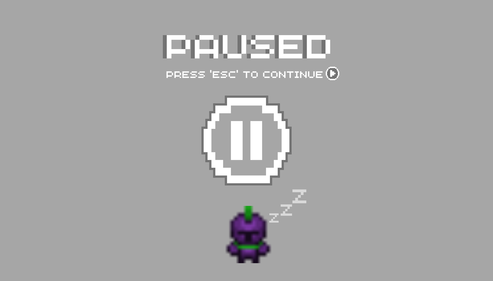
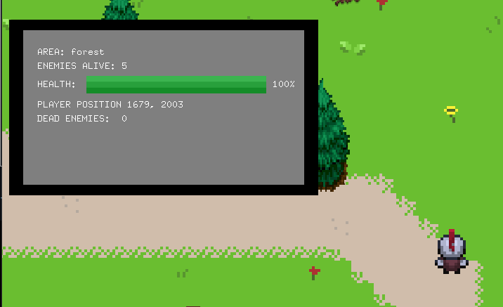
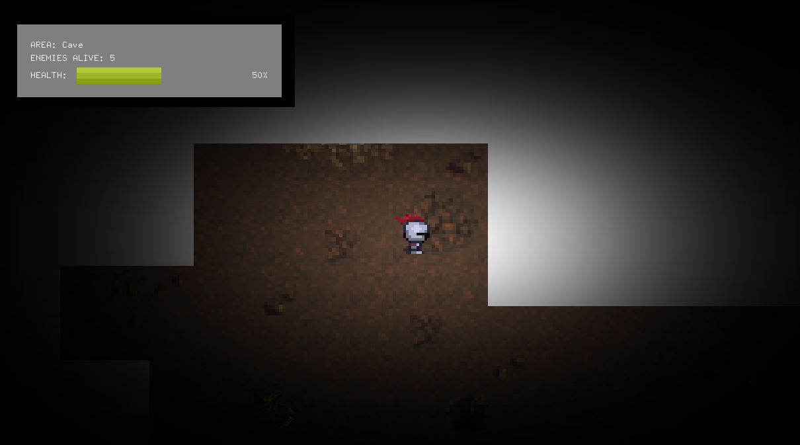
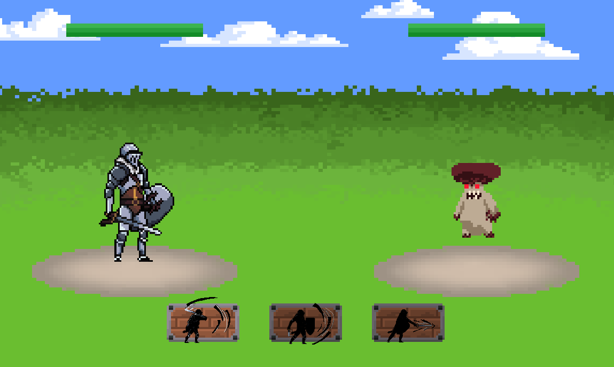
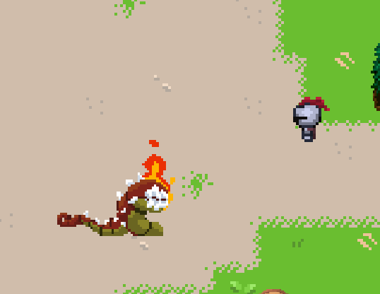
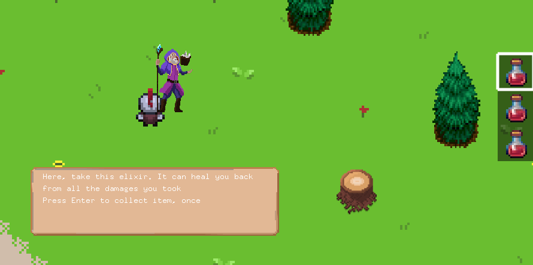
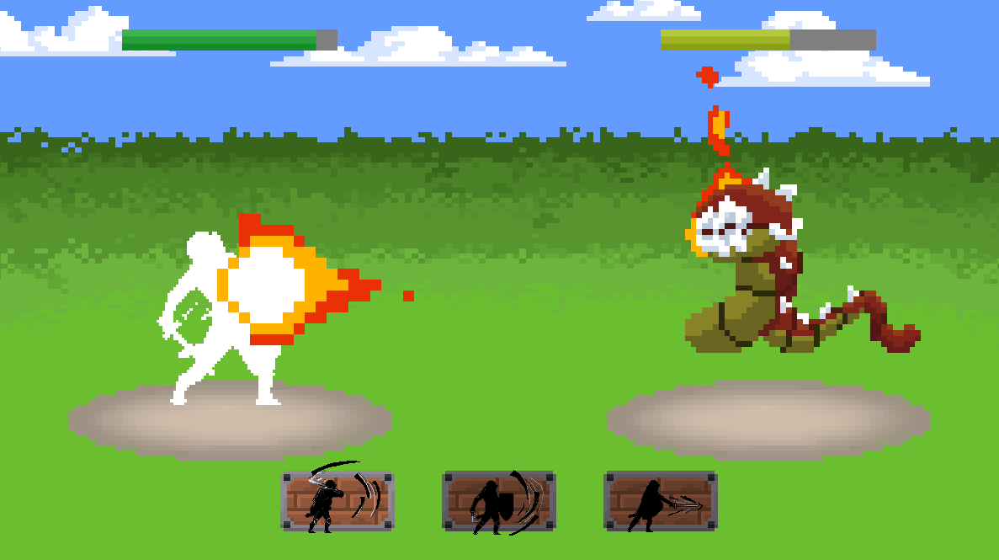
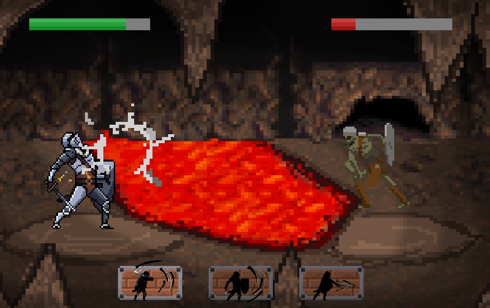
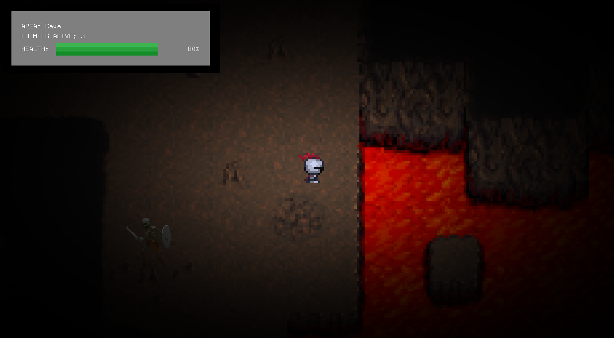

# PA2: SPOOKY-QUEST

**SPOOKY-QUEST** is a modified version of the OpenFrameworks Spooky-Quest video game example, created as part of a Programming Assignment for the Advanced Programming Course. This project helps students build practical programming skills by making enhancements to the base code, requiring a strong understanding of programming concepts.

## Features

- **Walking Patterns**: The walking patterns of enemies have been updated from rectangular movement to triangular patterns for added difficulty.
  
- **Pause State**: Pressing **ESC** triggers a new game state that pauses the game in both the **OverWorld** and **BattleState**, inherited from the base `State` class.

  

- **HUD Display**: A Heads-Up Display (HUD) is shown, displaying the player's current health, the number of enemies alive, and the current area name. Pressing **"k"** reveals additional information such as the number of enemies dead and the player's position.

  

- **Collision Debugging**: Press **"t"** to display collision textures for debugging purposes.

  

- **Battle State Improvements**: The player now has multiple attack options in the BattleState, allowing for a richer combat experience.

  

- **Boss Spawn**: Press **"B"** to spawn the area's boss for debugging purposes.

  

- **Enemy Respawn**: Press **"r"** to respawn all enemies in the area for debugging.

- **Health Regeneration**: Press **"h"** to regenerate the player's health back to 100% for testing purposes.

- **Potion Collection and Usage**: Press **Space** to collect a healing potion from a friendly character. Press **"u"** to use the potion from the player's inventory.

  

- **Attack Animations**: Every enemy and boss in the game has unique attack animations to enhance the combat experience.

  

- **Special Enemy Attacks**: Some enemies use projectiles as their main attack, while others rely on melee attacks.

  

- **New Area - The Cave**: A new area called **The Cave** has been added to the game. This area features a **darkness effect** and unique environmental hazards. Stepping on lava deals double damage to the player’s health, water reduces health by a factor of one, and falling into the void results in instant death.

  

## How to Use

1. **Clone or Download the Repository**:
   Clone this repository to your local machine using Git or download it as a ZIP file.

2. **Master Branch**:
   Make sure you're using the **master branch** for the most up-to-date features and bug fixes.

3. **Controls**:
   - **"ESC"**: Pause the game.
   - **"k"**: Display additional information (e.g., number of enemies dead, player position).
   - **"t"**: Show collision texture for debugging.
   - **"B"**: Spawn the boss for the current area.
   - **"r"**: Respawn all enemies in the area.
   - **"h"**: Regenerate player's health to 100%.
   - **"Space"**: Collect a healing potion.
   - **"u"**: Use the healing potion from the player's inventory.

4. **Building and Running**:
   Ensure you have the necessary dependencies installed, and follow the instructions provided in the [OpenFrameworks documentation](https://openframeworks.cc/) for building and running the game on your system.

## Contributors

- **Alfredo D. Soto Vélez** - [alfredo.soto2@upr.edu](mailto:alfredo.soto2@upr.edu)
- **Diego A. Perez Gandarillas** - [diego.perez16@upr.edu](mailto:diego.perez16@upr.edu)

## License

This project is licensed under the MIT License. See the [LICENSE](LICENSE) file for more details.
